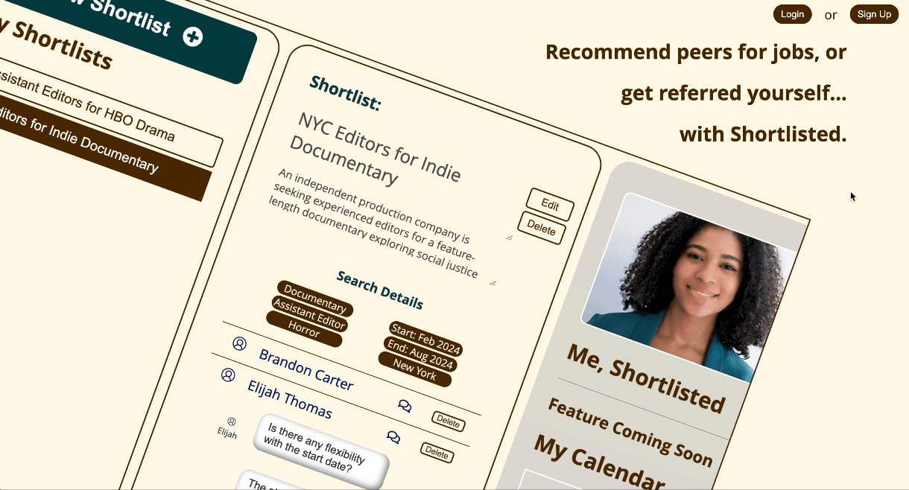
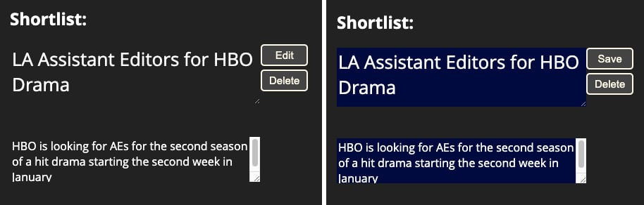
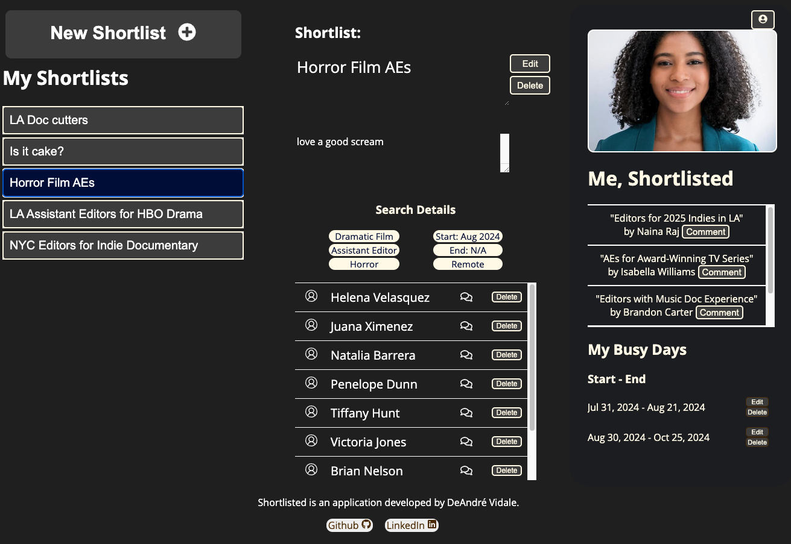
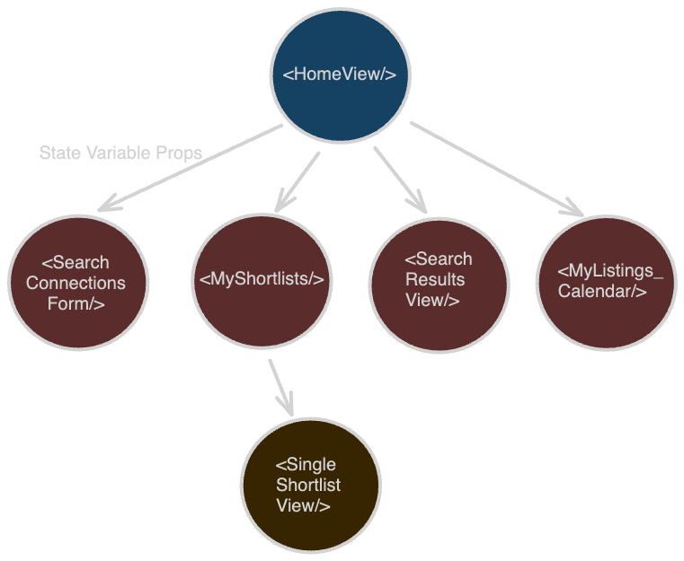

# Shortlisted

Shortlisted is a closed circle direct referral network for TV & Film Editors and Assistant Editors. The backend API is written in Python using the Flask server framework. The frontend functionality is built with React and the UI is enhanced with CSS. Shortlisted users can create profiles, connect with their peers, curate lists of references for different job opportunities, and communicate with their peers about the jobs. Each user can list their areas of expertise, and block out days of availability to ensure they appear in shortlists for opportunities that are perfect for them.

## Live Website

https://shortlisted-m7e4.onrender.com

## Table of Contents

- [Technologies Used](#technologies-used)
- [Features](#features)
- [Screenshots](#screenshots)
- [Technical Implementations](#Technical-Implementations)
- [Set Up](#set-up)
- [Wiki Documentation](#wiki-documentation)
- [Contact](#contact)

## Technologies Used

### Frameworks and Libraries

       

### Database


### Hosting


## Features

1.  Shortlists
2.  Comment Threads

### Future Features

1. Availability Calendar
2. Connections
3. Endorsements
4. Ranked Search
5. Facebook Login
6. Google Maps API Integration


## Screenshots

### Landing Page



### Create a Shortlist

### Edit a Shortlist Title or Description

### Message a Referral


## Technical Implementations

### Filtering Connections by Availability

Filtering connections by their availability is a key feature of Shortlisted. Python's inconsistent handling of date data types required an atypical dataflow to reliably filter users' bookings.

Certain Python date data types cannot be compared to each other, which led to unpredictable behavior as date data from Shortlisted users would be translated from Javascript on the frontend into JSON strings for packaging, and then parsed into Python in the backend routes. With no definitive methodology for reconciling the different date data types, leveraging the more consistent Javascript date objects became essential.

For the shortlist search query functionality, all other attributes of users are filtered in the backend route except for their availability. This approach maximizes the backend server's speed for gathering and sending back only the most relevant data from the database.

```python

if searchForm.validate_on_submit():
        user = User.query.get(id)
        user_network = user.my_connections()
        # user_network are all the users the current user is connected to, whether by invitation sent or received

        request_data = request.json
        # .json turns request data into a dict

        # if a parameter is present add its filter to filter list, if not, add its anti-filter
        location_matched = filter( lambda user: location[0] in user['locations'], user_network)

        industry_matched = filter(lambda user: industry_area[0] in user['industry_areas'], location_matched)

        job_title_matched = filter(lambda user: job_title[0] in user['job_title'], industry_matched)

        genre_matched = None

        if(genre[0] != 'None'):

            genre_matched = filter(lambda user: genre[0] in user['genres'], job_title_matched)
        else:

            genre_matched = filter(lambda user: genre[0] not in user['genres'], job_title_matched)

        search_results_lst = list(genre_matched)
        # ? this list comp removes duplicates from the list
        search_results = [i for n, i in enumerate( search_results_lst) if i not in  search_results_lst[:n]]

        return search_results, 200

```

The users returned to the frontend are then passed through a filter where their booking dates are converted into Javascript date objects and then compared against the start date and end date search parameters.

```javascript
const availCheck = (connection) => {
  let noConflict = true;
  let i = 0;

  if (connection["bookings"].length === 0) return noConflict;

  while (noConflict && i < connection["bookings"].length) {
    const booking = connection["bookings"][i];
    const [bookingStart, bookingEnd] = booking;
    const booking_start = new Date(bookingStart);
    const booking_end = new Date(bookingEnd);
    const paramsStart = new Date(searchParams["start_date"]);
    const paramsEndCheck = searchParams["end_date"];
    const paramsEnd = paramsEndCheck ? new Date(paramsEndCheck) : null;

    if (booking_start < paramsStart && paramsStart < booking_end)
      noConflict = false;
    // checks if start date overlaps with a current booking

    if (paramsEnd !== null) {
      if (booking_start < paramsEnd && paramsEnd < booking_end)
        noConflict = false;
      // checks if the job ending overlaps with current booking dates

      if (booking_start < paramsStart && paramsEnd < booking_end)
        noConflict = false;
      // checks for current booking wrapping around job opp

      if (paramsStart < booking_start && booking_end < paramsEnd)
        noConflict = false;
      // checks if job opp wraps around current booking
    }
    i++;
  }
  return noConflict;
};

let avail_filtered_results = [];

if (searchResults.length > 0 && searchResults !== null) {
  avail_filtered_results = searchResults.filter((connection) =>
    availCheck(connection)
  );
}
```

By continuing the search result filtering on the frontend in Javascript, rather than relying on Python in the backend, the dates can be filtered reliably, presenting only the most effective list of candidates for the shortlist to the user.

### Inline Form Fields

In order to maintain a streamlined UI, the Shortlist Title and Description utilize inline form fields for seamless editing of their text.



This is achieved by structuring CSS style commands in alignment with button logic to functionally and visually enable and disable the form inputs.

The title and description text that is visible on screen is loaded from the Redux state into the form fields, and the form fields are set to default as disabled for editing. By then adding CSS style commands to hide the form field surrounding the text, the UI appears to be rendering the text alone. When the edit button is pressed, the CSS style commands are changed by triggering a change in the class associated with the form field elements.

#### Local state variable managing CSS classes
```javascript
const [activeFields, setActiveFields] = useState("edit-off");
```


#### CSS Style Commands
``` CSS

.edit-on {
    background: var(--dark-bg-5);
    border:none;
  }

.edit-off {
    background: transparent;
    border: none;
  } 

```


#### The Edit Button and onClick function
```javascript
<button type="button" onClick={editSwitch}>{`Edit`}</button>
```

```javascript
const editSwitch = () => {
  if (editForm) {
    setEditForm(false);
    setActiveFields("edit-off");
   
  } else {
    setEditForm(true);
    setActiveFields("edit-on");
  
  }
};
```

#### The title and description form fields

```javascript

<div className={formBorder}>
   <textarea
      id="edit-shortlist-title"
      className={activeFields}
      disabled={editForm === false}
      value={title}
      placeholder="Please give this shortlist a title"
      onChange={(e) => setTitle(e.target.value)}
              />
   <p className="error">{errors.title}</p>
            </div>

<div className={formBorder}>
   <textarea
      id="edit-shortlist-desc"
      className={activeFields}
      disabled={editForm === false}
      value={description}
      maxLength={255}
      onChange={(e) => setDescription(e.target.value)}
            />
        //  </div>

```

### Panel Visibility with CSS

The Shortlisted app features a multi-panel, single layout UI for a very intuitive and focused user experience.



React components are typically rendered according to the triggering of specific frontend routes. Using this approach for a single layout design would require a lot of redundancy in rendering components at each route in order to appear to be a single view. It would also require a very inefficient data flow structure in order to make sure the re-rendered components still have the correct data. 

The single layout view for Shortlisted is achieved by a combination of state variables, buttons and CSS style commands.

I initialized several state variables in a top level component as a sort of library of functionality for every other component. I then nested all of my main components inside of the top level component, and passed down the state variables as needed as props.



#### The state variables passed down from the top level component:
``` javascript
  const [shortlistIdx, setShortlistIdx] = useState(firstIdx || null);
  const [editForm, setEditForm] = useState(false);
  const [searchFormView, setSearchFormView] = useState(false);
  const [showSearchResults, setShowSearchResults] = useState(false);
  const [searchSubmitted, setSearchSubmitted ] = useState(false)
```
#### A sample of component views controlled by CSS and state variables:

``` javascript

<div id="my-shortlists"
      className={searchFormView ? "hide-view" : "show-view"}
            >
              <MyShortlists
                shortlistIdx={shortlistIdx}
                setShortlistIdx={setShortlistIdx}
                saved_shortlists={saved_shortlists}
                setEditForm={setEditForm}
                searchFormView={searchFormView}
                setShowSearchResults={setShowSearchResults}
              />
</div>   
<div
    id="single-shortlist-view"
    className={`${
      showSearchResults ? "center-panel hide-view" : "center-panel show-view"}`}
      >
        <SingleShortlistView
          setEditForm={setEditForm}
          editForm={editForm}
          setShortlistIdx={setShortlistIdx}
          shortlistIdx={shortlistIdx}
          showSearchResults={showSearchResults}
        />
</div>

```

This structure for my React components allowed buttons inside the components to effect the rendering of other components without them having to be nested within each other, or navigated to via routes.


## Set Up

To set up and run the project locally, follow these steps:

1. Clone the repository to your local machine:

   ```
   git clone https://github.com/dvidale/shortlisted.git
   ```

2. Navigate to the project directory:

```
cd shortlisted
```

3. Install the project dependencies:

   In the frontend directory: `shortlisted/react-vite/`

   ```bash
   npm install
   ```

   In the root directory: `shortlisted/`

   ```bash
   pipenv install -r requirements.txt
   ```

4. Create a .env file from the included example file.

5. Start the development servers:

   Backend directory: `shortlisted/`

   ```bash
   pipenv run flask run
   ```

   Frontend directory: `shortlisted/react-vite/`

   ```bash
   npm run dev
   ```


##Wiki Documentation

### Find the following additional documentation in our Wiki

- [Database Schema](https://github.com/dvidale/shortlisted/wiki/Database-Schema)
- [Features List](https://github.com/dvidale/shortlisted/wiki/Feature-List)
- [User Stories](https://github.com/dvidale/shortlisted/wiki/User-Stories)
- [API Endpoints](https://github.com/dvidale/shortlisted/wiki/API-Endpoints)
- [Redux Store Tree](https://github.com/dvidale/shortlisted/wiki/Redux-Store-Tree)

## Contact

DeAndré Vidale

- [Github](https://github.com/dvidale)
- [Website](https://deandrevidale.com)
- [Email](mailto:deandre.vidale@gmail.com)
- [LinkedIn](https://www.linkedin.com/in/deandrevidale/)
